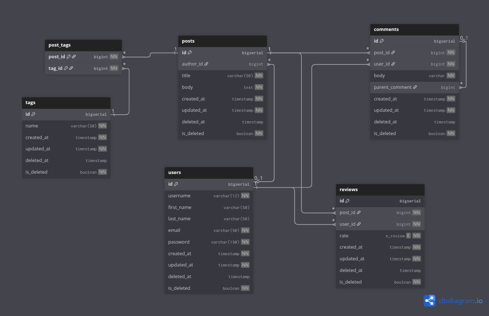

# Database Design Document - Blogging Platform

This document outlines the conceptual, logical, and physical models of the blogging platform's relational database.

## 1. Conceptual Model
The system is centered around content creation and user interaction. The main entities are:
- **User**: The author of posts and comments.
- **Post**: The core content created by users.
- **Comment**: Feedback provided by users on posts, supporting threading (parent-child).
- **Tag**: Keywords for classifying posts.
- **Review**: Star-based ratings (1-5) for posts.

## 2. Logical Model
The logical model defines the relationships and keys:
- **Users** (1) <--- (M) **Posts** (Foreign Key: `author_id`)
- **Posts** (1) <--- (M) **Comments** (Foreign Key: `post_id`)
- **Users** (1) <--- (M) **Comments** (Foreign Key: `user_id`)
- **Posts** (1) <--- (M) **Reviews** (Foreign Key: `post_id`)
- **Users** (1) <--- (M) **Reviews** (Foreign Key: `user_id`)
- **Posts** (M) <---> (M) **Tags** (Via `post_tags` junction table)

## 3. Physical Model
The database is implemented in **PostgreSQL**.

### Entity Relationship Diagram (ERD)

### Table Attributes & Constraints

#### `users`
| Attribute | Type | Constraints | Description |
|-----------|------|-------------|-------------|
| `id` | BIGSERIAL | PRIMARY KEY | Unique identifier for the user |
| `username` | VARCHAR(12) | UNIQUE, NOT NULL | User's unique handle |
| `first_name` | VARCHAR(50) | | User's first name |
| `last_name` | VARCHAR(50) | | User's last name |
| `email` | VARCHAR(50) | UNIQUE, NOT NULL | User's email address |
| `password` | VARCHAR(150) | NOT NULL | Argon2 hashed password |
| `is_deleted`| BOOLEAN | DEFAULT false | Soft delete flag |
| `created_at`| TIMESTAMP | DEFAULT NOW() | Record creation time |

#### `posts`
| Attribute | Type | Constraints | Description |
|-----------|------|-------------|-------------|
| `id` | BIGSERIAL | PRIMARY KEY | Unique identifier for the post |
| `author_id`| BIGINT | REFERENCES users(id) | The user who wrote the post |
| `title` | VARCHAR(50) | NOT NULL | Title of the blog post |
| `body` | TEXT | NOT NULL | Main content of the post |
| `is_deleted`| BOOLEAN | DEFAULT false | Soft delete flag |

#### `comments`
| Attribute | Type | Constraints | Description |
|-----------|------|-------------|-------------|
| `id` | BIGSERIAL | PRIMARY KEY | Unique identifier for the comment |
| `post_id` | BIGINT | REFERENCES posts(id) | The post being commented on |
| `user_id` | BIGINT | REFERENCES users(id) | The user who made the comment |
| `body` | VARCHAR | NOT NULL | The comment text |
| `parent_comment`| BIGINT | REFERENCES comments(id)| Self-reference for threading |

#### `tags`
| Attribute | Type | Constraints | Description |
|-----------|------|-------------|-------------|
| `id` | BIGSERIAL | PRIMARY KEY | Unique identifier for the tag |
| `name` | VARCHAR(50) | UNIQUE, NOT NULL | The tag keyword |

#### `reviews`
| Attribute | Type | Constraints | Description |
|-----------|------|-------------|-------------|
| `id` | BIGSERIAL | PRIMARY KEY | Unique identifier for the review |
| `post_id` | BIGINT | REFERENCES posts(id) | The post being rated |
| `user_id` | BIGINT | REFERENCES users(id) | The user who gave the rating |
| `rate` | e_review | ENUM (1-5) | Star rating value |

#### `post_tags`
| Attribute | Type | Constraints | Description |
|-----------|------|-------------|-------------|
| `post_id` | BIGINT | PRIMARY KEY, FK | Reference to the post |
| `tag_id` | BIGINT | PRIMARY KEY, FK | Reference to the tag |

### Normalization (3NF)
- **1NF**: All attributes are atomic. Primary keys are defined for all tables.
- **2NF**: No partial dependencies. All non-key attributes depend on the entire primary key.
- **3NF**: No transitive dependencies. For example, user details are in the `users` table, not duplicated in `posts`.

### Constraints and Integrity
- **Soft Deletes**: Managed via `is_deleted` (boolean) and `deleted_at` (timestamp) columns.
- **Referential Integrity**: 
    - `ON DELETE SET NULL` for `author_id` (keep posts if author is deleted).
    - `ON DELETE CASCADE` for comments and tags associated with a deleted post.
- **Data Validation**: 
    - `email` and `username` must be unique.
    - `rate` in reviews is restricted by an ENUM (`ONE` to `FIVE`).
