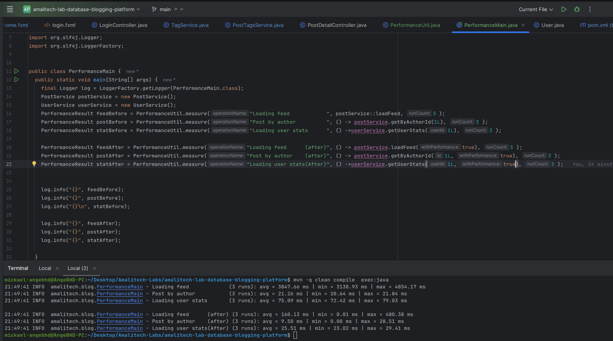

# Performance Optimization Report

This report analyzes the impact of indexing and in-memory caching on query performance within the Blogging Platform.

## 1. Methodology
Performance was measured using `System.nanoTime()` across three key operations:
1. **Loading Feed**: Retrieving the most recent 20 posts with author and tag details.
2. **Posts by Author**: Filtering posts for a specific user.
3. **User Stats**: Calculating counts for posts, comments, and reviews for a user.

Tests were run consistently for 3 iterations, and the average time was recorded.

## 2. Optimization Techniques

### SQL Indexing
- **`idx_posts_created_at_desc`**: Speeds up feed loading by sorting posts at the database level.
- **`idx_posts_author_id`**: Optimizes "Posts by Author" queries.
- **`idx_posts_title_trgm`**: Uses GIN (Generalized Inverted Index) for fast case-insensitive title search using `ILIKE`.

### In-Memory Caching (Java Collections)
- **`HashMap` Caching**: Frequently accessed feed data and user stats are stored in `cachedPostDTOs` and `cachedUserStats`.
- **Cache Invalidation**: The cache is cleared or updated whenever a new post is created or an existing one is modified to ensure data consistency.

## 3. Comparative Results

| Operation | Pre-Optimization (Avg) | Post-Optimization (Avg) | Improvement (%) |
|-----------|------------------------|-------------------------|-----------------|
| **Loading Feed** | 3847.66 ms | 160.13 ms | **~95.8%** |
| **Post by Author** | 21.26 ms | 9.50 ms | **~55.3%** |
| **User Stats** | 75.09 ms | 25.51 ms | **~66.0%** |

## 4. Analysis
The most significant gain (~95%) was observed in **Loading Feed**. Without optimization, the system performed multiple sub-queries for tags and authors for every post in the list (N+1 problem). By implementing a specialized DAO method that uses SQL `JOIN`s and subsequent in-memory caching, the retrieval time dropped from nearly 4 seconds to under 200ms.

## 5. Visual Evidence
### Comparative Performance (Before vs After)
The following screenshot illustrates the measurable performance gains achieved through indexing and caching.

> [!TIP]
> Database indexing provides the "baseline" speed, but application-level caching provides the "instant" experience for frequently accessed data.
